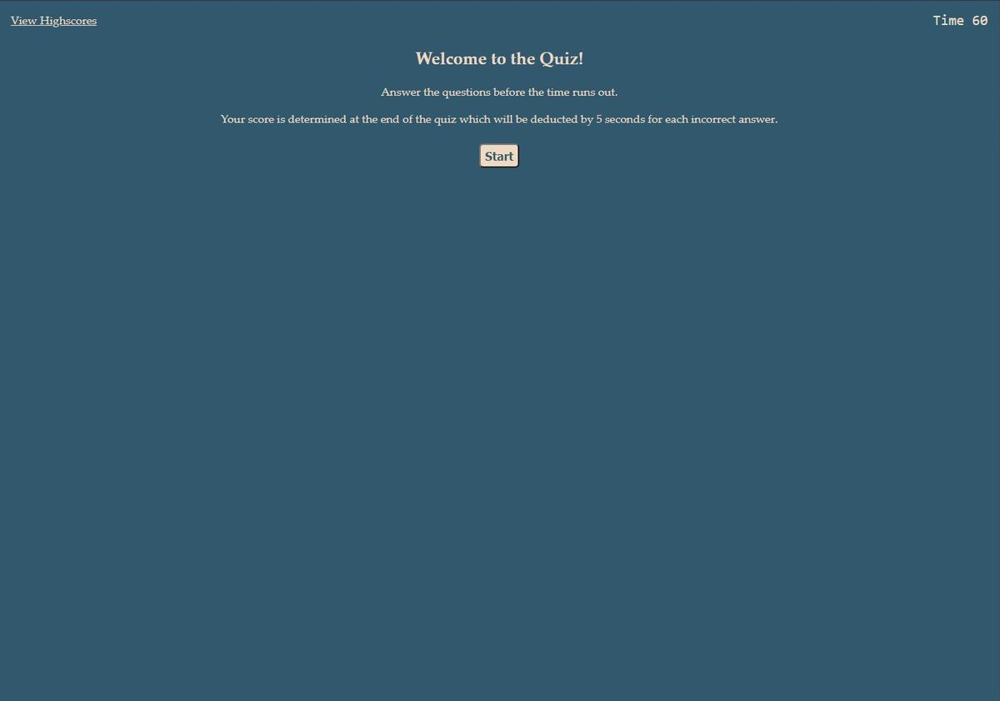
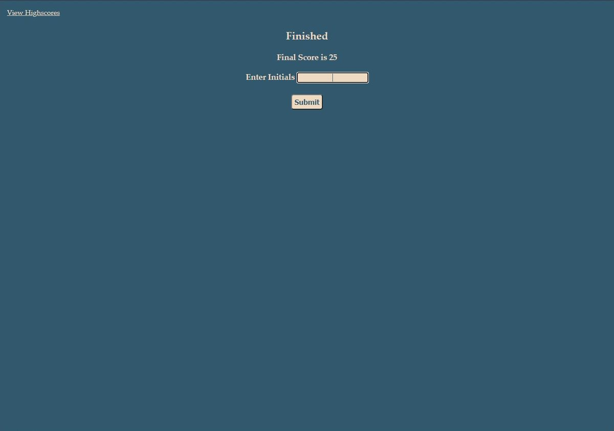

# Homework 4 - Code Quiz
## Description
This is a timed quiz on basic JavaScript knowledge. The user's score is based on time remaining upon finishing and seconds are subtracted for incorrect answers. User initials can be entered at the end to record their score.

## Screenshot

---

Check out the [deployed web page](https://neilburt.github.io/code-quiz/).